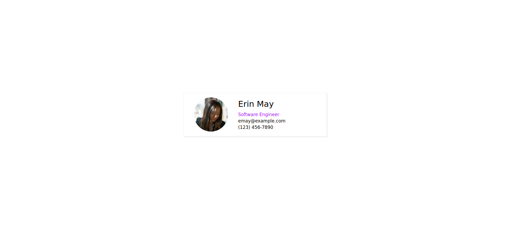
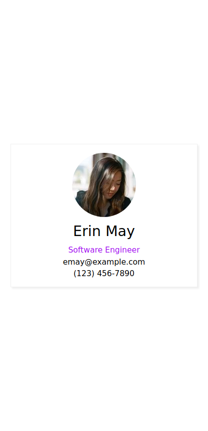

# Blunt

[Join the Discord](https://discord.gg/EZJEwsP)

Version: 1.1.0

A CSS framework without all the fluff. 

Blunt doesn't have any opinions on how your applications should look. It only provides helper classes to make positioning and responsive design easier.

# Why another CSS framework...?

There seem to be hundreds of these things out there. So why bother with another one? 
Well, I was sick of fighting with the other options. Most are overly opinionated and result in spending time
fighting the framework instead of it boosting productivity. I have tried so many different ones. Some do too
much, others do too little. I needed some middle ground that worked for _specifically_ what I wanted. I don't want to write any CSS
that does positioning elements. I want to write CSS that only does the _styling_ of my elements (e.g. text color, borders, background colors, etc).

That means that I never want to write `display: flex;` or `display: grid;` but I have no problem writing `color: var(--off-white);`.

I also never want to write another `@media` query again. I want all of my positioning code to get done within the HTML itself.

I also don't want something that does more than this. I don't want to have to install an NPM package to get what I need.
I just want to include the CSS file and be done with it.

As a result, Blunt does the following:

1. Provides a responsive container for 3 different screen sizes (sm, md, lg)
2. Provides margin classes 
3. Provides padding classes
4. Provides width classes 
5. Provides height classes 
6. Provides font size and line height classes
7. Provides grid classes
8. Provides a row and column class 
9. Provides classes to align text and elements
10. Never requires me to write CSS for positioning.

It does nothing else.

# Getting Started

Simply add the following line to your HTML file.

```
<link rel="stylesheet" type="text/css" href="https://cdn.jsdelivr.net/gh/f-prime/blunt/dist/blunt.min.css">
```

NOTE: Blunt is big at around 1mb minified. Along with standard gzip compression, it is highly suggested that in a production environment a tool like [purify-css](https://www.npmjs.com/package/purify-css) is used to minimize blunt as much as possible. There will be a noticable performance decrease if not.

# Building the CSS

Blunt is written in SCSS. To generate the CSS code clone the repo and run the following command:

`sass src/blunt.scss blunt.css`

# Example

Let's create a simple responsive card using Blunt.

```html
<div class="container mx-auto h-100 row v-center h-center">
  <div class="card lg-w-30 md-w-40 sm-w-90 pt-2 pb-2 pl-2 pr-2">
    <div class="sm-col md-row lg-row md-v-center lg-v-center">
      <div class="sm-mx-auto">
        
      </div>
      <div class="sm-mx-auto sm-text-center font-1p2 lg-ml-2 md-ml-2">
        <div class="sm-pt-1p3 pb-1p3 font-2p2">Erin May</div>
        <div class="purple">Software Engineer</div>
        <div class="pt-0p5 pb-0p5">emay@example.com</div>
        <div>(123) 456-7890</div>
      </div>
    </div>
  </div>
</div>  

<style>
  html {
    font-family: sans-serif;
  }

  .purple {
    color: #A010F0;
  }

  .rounded { 
    border-radius: 100%;
  }

  .card {
    border: 1px solid #efefef;
    box-shadow: 3px 3px 3px #efefef;
  }
</style>
```

Large



Medium


Small



# Classes

Blunt supports three screen sizes:

1. `sm` which has a max width of 900px
2. `md` which has a max width of 1500px
3. `lg` which is anything above 1500px

Blunt supports decimal values on some classes using the following syntax `{integer}p{fraction}` where `fraction` is a number from 1 to 9

As an example, if we want to set the font size on a small screen we can use the class `sm-font-1p2` which will sent the font size on small screens to `1.2rem`
If we want the font size to be 1.2rem on all screen sizes we can remove the `sm` and use the class `font-1p2`. Screen size specific classes override the global values for their respective screen sizes.
Whole numbers do not use the `{number}p{fraction}` syntax. For a font size of `1rem` the following class is used: `font-1`.

### All Blunt classes

`container` - Responsive container class

`{size}-grid` - Sets display of element to `grid`

`{size}-grid-h-center` - Center aligns grid items horizontally 

`{size}-grid-v-center` - Center aligns grid items vertically

`{size}-grid-h-end` - Aligns grid items to their horizontal end

`{size}-grid-v-end` - Aligns grid items to their vertical end

`{size}-grid-{1-10}` - Defines number of columns in grid (between 1 and 10 columns)

`{size}-gap-{0-4}p{1-9}` - Defines the grid gap between 0.1 and 4 rem

`{size}-m{l,r,t,b}-auto` - Margin class `ml-auto` does `margin-left: auto`

`{size}-auto-center, {size}-mx-auto` - Does `margin-left: auto; margin-right: auto;`

`{size}-my-auto` - Does `margin-top: auto; margin-bottom: auto;`

`{size}-text-{left, right, center}` - Aligns text in one of three locations: left, right, or center

`{size}-m{t,l,r,b,x,y}-{0-15}p{0-9}` - Margin class `sm-mt-3p3` will resolve to  `margin-top: 3.3vh` for the small screen size

`{size}-p{t,l,r,b,x,y}-{0-15}p{0-9}` - Padding class `md-pl-3p3` will resolve to  `padding-left: 3.3vw` for the medium screen size.

`{size}-pxm{t,l,r,b,x,y}-{0-1000}` - Margin class `lg-pxmt-50` will resolve to `margin-top: 50px` for the large screen size.

`{size}-pxp{t,l,r,b,x,y}-{0-1000}` - Padding class `sm-pxpl-25` will resolve to `padding-left: 25px` for the small screen size.

 NOTE: For padding Blunt also provides bidirectional padding and margin `px-`, `py-`, `mx-`, `my-`. `px-5` will resolve to `padding-left: 5vw; padding-right: 5vw;` and the equivalent for `mx-5` 

`{size}-lh-{0-4}p{0-9}` - Line height class `lg-lh-1p3` will resolve to `line-height: 1.3rem` for the large screen 

`{size}-font-{0-4}p{0-9}` - Font size class `font-2` will resolve to `font-size: 2rem;` for all screen sizes

`{size}-w-{0-100}` - Width class `sm-w-80` will resolve to `width: 100%;` on small screens.

`{size}-vw-{0-100}` - Width class `sm-vw-80` will resolve to `width: 100vw;` on small screens.

`{size}-{min,max}-w-{0-100}` - Width calss `min-w-50` resolves to `min-width: 50%`

`{size}-{min,max}-vw-{0-100}` - Width class `max-vw-50` resolves to `max-width: 50vw`

`{size}-{min,max}-h-{0-100}` - Height calss `min-h-50` resolves to `min-height: 50%`

`{size}-{min,max}-vh-{0-100}` - Height class `max-vh-50` resolves to `max-height: 50vw`

`{size}-h-{0-100}` - Height class `md-h-100` will resolve to `height:100%;` on medium screens.

`{size}-vh-{0-100}` - Height class `md-vh-100` will resolve to `height:100vh;` on medium screens.

`{size}-row` - `sm-row` will resolve to `width: 100%; display: flex; flex-direction: row;` for small screens

`{size}-col` - `lg-col` will resolve to `width: 100%; display: flex; flex-direction: column;` for large screens

`{size}-{v, h, align, justify}-{start, center, end, inherit, initial, space-evenly, space-around, space-between}` - `lg-h-center` will center the row items horizontally on large screens 

`{size}-{wrap, no-wrap, wrap-reverse, wrap-initial, wrap-inherit}` - `sm-wrap` outputs `flex-wrap: wrap;` for small screens.

`{size}-text-{center, left, right}` - `text-center` will center text

`{size}-hidden` - `lg-hidden` will hide an element on large screens

`{size}-px{w,h}-{0-1000}` - `lg-pxw-300` will resolve to `width: 300px` on large screens `md-pxh-200` will resolve to `height: 200px` on medium screens.

`{size}-{min,max}-px{w, h}-{0-1000}` - `sm-min-pxw-600` resolves to `min-width: 600px` on small screens

`{size}-{absolute, static, sticky, fixed}` - `lg-fixed` will resolve to `position: fixed;` for large screens 

`{size}-{top, left, right, bottom}-{1-100}` - `md-top-5` will resolve to `top:5vh;` for medium screens 
